# Experimental Architecture

## Section 3.4.1 — Proposed Experimental Architecture

Figure 3.1 shows the proposed architecture of the system used to implement and evaluate the
selected lightweight encryption algorithms. The architecture is made up of five components.

The **Experimental Control Module** chooses the algorithm, test data size and trial number for
each run. The **Encryption Algorithm Module** holds the four implemented ciphers — AES, PRESENT,
SPECK and ASCON. Each cipher produces a ciphertext output that is then processed by the
corresponding **Decryption Algorithm Module** to recover the plaintext. Running alongside the
encryption and decryption processes, the **Performance Monitoring Unit** records timing, memory
and throughput information. This information is sent to the **Data Logger** for storage. Finally
it is passed to the **Analysis and Comparison Module**, where the results are compiled into
tables and charts as described in Section 3.7.

---

## Figure 3.1: Proposed Experimental Architecture

```mermaid
flowchart TD
    DATA["<b>Sample IoT Test Data</b><br/>1 KB / 10 KB / 100 KB / 1 MB"]
    CTRL["<b>Experimental Control Module</b><br/>selects algorithm, data size, trial number"]
    ENC["<b>Encryption Algorithm Module</b><br/>AES &#124; PRESENT &#124; SPECK &#124; ASCON"]
    CT["<b>Ciphertext Output</b>"]
    DEC["<b>Decryption Algorithm Module</b><br/>matching cipher"]
    PT["<b>Recovered Plaintext</b>"]
    PMU["<b>Performance Monitoring Unit</b><br/>timers, memory profiler, throughput counter"]
    LOG["<b>Data Logger</b><br/>CSV / spreadsheet results store"]
    ANA["<b>Analysis &amp; Comparison Module</b><br/>mean, std. dev., charts"]

    DATA --> CTRL
    CTRL -->|input| ENC
    ENC --> CT
    ENC -->|record| PMU
    CT --> DEC
    DEC --> PT
    DEC -->|record| PMU
    PMU --> LOG
    LOG --> ANA

    style DATA fill:#ffe6cc,stroke:#d79b00,stroke-width:2px
    style CTRL fill:#dae8fc,stroke:#6c8ebf,stroke-width:2px
    style ENC fill:#d5e8d4,stroke:#82b366,stroke-width:2px
    style DEC fill:#d5e8d4,stroke:#82b366,stroke-width:2px
    style CT fill:#dae8fc,stroke:#6c8ebf
    style PT fill:#dae8fc,stroke:#6c8ebf
    style PMU fill:#fff2cc,stroke:#d6b656,stroke-width:2px
    style LOG fill:#dae8fc,stroke:#6c8ebf,stroke-width:2px
    style ANA fill:#dae8fc,stroke:#6c8ebf,stroke-width:2px
```

---

## Component Responsibilities

### 1. Sample IoT Test Data

Synthetic sensor-style data generated at four sizes (1 KB, 10 KB, 100 KB, 1 MB) to represent
typical IoT payloads. No confidential or personal data is used. The same generated bytes are
supplied to all four algorithms so that the comparison is based on identical input.

**Implementation:** `05_Data_or_Sample_Input/generate_test_data.py`

### 2. Experimental Control Module

Selects the algorithm, the test data size and the trial number for each run. It is responsible
for holding the experimental conditions constant: it supplies the same plaintext to every
cipher, enforces the fixed trial count, and sequences the runs so that no algorithm receives a
different execution context from another.

**Implementation:** `04_Source_Code/harness/control_module.py`

### 3. Encryption Algorithm Module

Holds the four implemented ciphers behind a common interface, so that the control module can
invoke any of them identically. Each cipher exposes `encrypt(key, nonce, plaintext)` and
returns the ciphertext.

**Implementation:** `04_Source_Code/ciphers/`

### 4. Decryption Algorithm Module

Applies the matching cipher to the ciphertext to recover the plaintext. The recovered plaintext
is compared against the original input on every trial. A mismatch invalidates the trial, which
protects the study from recording timing data produced by an incorrect implementation.

**Implementation:** `04_Source_Code/ciphers/` (the `decrypt` half of the same interface)

### 5. Performance Monitoring Unit

Runs alongside encryption and decryption and records:

- encryption time and decryption time (monotonic high-resolution timer)
- peak memory allocated during the operation (allocation tracker)
- throughput derived from payload size and elapsed time

The same timer and the same memory tracker are used for all four algorithms.

**Implementation:** `04_Source_Code/harness/monitor.py`

### 6. Data Logger

Stores one row per trial in a CSV file, so that raw measurements are preserved and can be
re-analysed independently. Storing raw per-trial rows rather than pre-aggregated values supports
the transparency and reproducibility requirement in Section 3.6.3.

**Implementation:** `04_Source_Code/harness/data_logger.py`

### 7. Analysis and Comparison Module

Reads the CSV, computes the mean and standard deviation of each metric per algorithm per data
size, and produces the comparison tables described in Section 3.7.

**Implementation:** `04_Source_Code/harness/analysis.py`

---

## Data Flow Summary

| Step | From | To | Data Passed |
|---|---|---|---|
| 1 | Test Data | Control Module | Plaintext bytes and size label |
| 2 | Control Module | Encryption Module | Algorithm name, key, nonce, plaintext |
| 3 | Encryption Module | Ciphertext Output | Ciphertext bytes |
| 4 | Encryption Module | Performance Monitor | Elapsed time, peak memory |
| 5 | Ciphertext Output | Decryption Module | Ciphertext bytes |
| 6 | Decryption Module | Recovered Plaintext | Plaintext bytes (verified against input) |
| 7 | Decryption Module | Performance Monitor | Elapsed time, peak memory |
| 8 | Performance Monitor | Data Logger | One trial record |
| 9 | Data Logger | Analysis Module | Complete results CSV |
