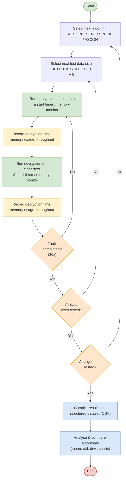

# Experimental Process Flowchart

## Section 3.4.2 — Experimental Process Flowchart

Figure 3.2 shows the flowchart of the experimental process. For each algorithm the process goes
through every defined test data size. For each data size the encryption and decryption
operations are repeated for the number of trials while performance metrics are recorded. After
all trials, data sizes and algorithms are finished, the collected results are put into a dataset
and sent to the analysis stage described in Section 3.7.

---

## Figure 3.2: Experimental Process Flowchart

---

## Loop Structure

The flowchart contains three nested loops:

| Loop | Iterations | Controlled By |
|---|---|---|
| Innermost — trials | 30 | `TRIALS_PER_CONFIGURATION` in `control_module.py` |
| Middle — data sizes | 4 | `DATA_SIZES` in `control_module.py` |
| Outermost — algorithms | 4 | `ALGORITHMS` in `control_module.py` |

Total measured runs: **4 algorithms × 4 data sizes × 30 trials = 480 encryption/decryption
pairs**, producing 480 rows in the results CSV.

---

## Verification Step

The flowchart as drawn in Figure 3.2 shows the measurement path. The implementation adds one
verification step that is not shown in the figure for readability: after each decryption, the
recovered plaintext is compared byte-for-byte against the original input. If the comparison
fails, the run is marked invalid and excluded from the analysis.

This step exists because a timing measurement taken from an incorrect cipher implementation
would be meaningless. It directly supports the validity of the comparison required by RO3.

---

## Warm-Up Handling

Before the 30 measured trials for each configuration, the framework performs a small number of
unmeasured warm-up iterations. This is done because the first execution of a code path in an
interpreted runtime includes one-time costs (bytecode caching, lazy initialisation) that are not
representative of steady-state cipher performance.

The same warm-up procedure is applied identically to all four algorithms, so it does not
advantage any one of them. The warm-up count is recorded in the results metadata so the
procedure remains reproducible.
