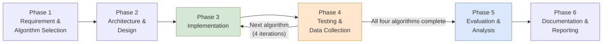

# Methodology Phases

## Section 3.3 — Methodology Phases

The overall research methodology is organised into six phases, moving from algorithm selection
to final documentation. Table 3.B summarises each phase, its main activities and its
relationship to the research objectives stated in Section 1.5.

---

## Table 3.B: Methodology Phases

| Phase | Name | Main Activities | Related Objective |
|---|---|---|---|
| **Phase 1** | Requirement & Algorithm Selection | Review Chapter 2 findings; confirm AES, PRESENT, SPECK and ASCON as the algorithms to be implemented; define experimental requirements | RO1 |
| **Phase 2** | Architecture & Design | Design the experimental architecture, define modules (control, encryption, monitoring, logging, analysis) and prepare the flowchart of the test process | RO1, RO2 |
| **Phase 3** | Implementation | Implement each algorithm within the chosen development environment; build the control, monitoring and logging modules | RO2 |
| **Phase 4** | Testing & Data Collection | Execute repeated trials across data sizes for each algorithm and record performance data | RO2, RO3 |
| **Phase 5** | Evaluation & Analysis | Compare recorded metrics across algorithms; identify trade-offs and overall findings | RO3 |
| **Phase 6** | Documentation & Reporting | Document source code and results on GitHub; compile findings into the final report and presentation | RO1–RO3 |

---

## Iterative Execution of Phases 3 and 4

These phases are not strictly sequential. As described in Section 3.2, the iterative development
model allows **Phases 3 and 4 to be repeated for each of the four algorithms** before the study
moves on to Phase 5.

This means that any implementation problem found while testing one algorithm can be fixed before
starting the next algorithm. At the same time, it ensures that all algorithms are evaluated using
the same experimental setup.

---

## Objective Traceability

| Objective | Statement | Phases | Evidence in Repository |
|---|---|---|---|
| **RO1** | Identify and select lightweight encryption algorithms suitable for resource-constrained IoT environments based on findings from existing literature | 1, 2, 6 | `01_Research_Papers/`, `02_Literature_Review/` |
| **RO2** | Implement the selected lightweight encryption algorithms in a controlled experimental environment using consistent test conditions | 2, 3, 4, 6 | `03_Architecture_and_Flowchart/`, `04_Source_Code/`, `05_Data_or_Sample_Input/` |
| **RO3** | Evaluate and compare the selected algorithms based on defined performance and resource-efficiency metrics | 4, 5, 6 | `06_Results_or_Expected_Output/` |

---

## Phase Deliverables

| Phase | Deliverable | Location |
|---|---|---|
| 1 | Confirmed algorithm list with literature justification | `02_Literature_Review/Algorithm_Comparison.md` |
| 2 | Architecture diagram and process flowchart | `03_Architecture_and_Flowchart/` |
| 3 | Working implementation of four ciphers plus measurement framework | `04_Source_Code/` |
| 4 | Test data generator and recorded results CSV | `05_Data_or_Sample_Input/`, `06_Results_or_Expected_Output/` |
| 5 | Comparison tables and summary statistics | `06_Results_or_Expected_Output/` |
| 6 | Repository documentation and final report | This repository |
